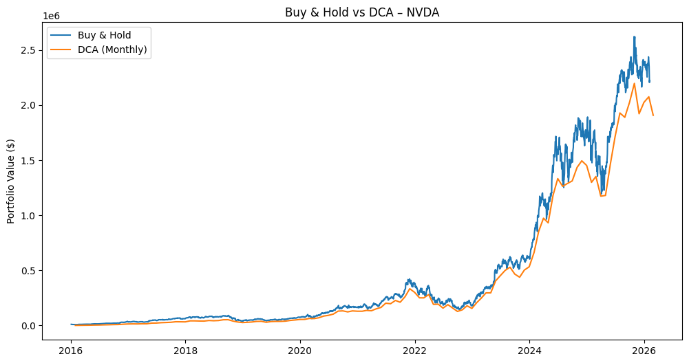

# NVIDIA (NVDA) Equity Strategy, Risk & Derivatives Analysis

## Overview
This project analyses the long-term performance and risk characteristics of NVIDIA (NVDA) using a Python-based backtesting framework. It evaluates capital deployment, downside risk, and hedging costs across multiple market regimes, with a focus on institutional-style portfolio analysis.

The study compares passive and rule-based strategies and examines their behaviour during periods of market stress, including the COVID-19 crash and the 2022 rate-tightening cycle.

---

## Objectives
- Build a reproducible equity backtesting framework
- Compare passive and systematic investment strategies
- Analyse risk-adjusted performance
- Evaluate drawdowns during crisis periods
- Examine option-based hedging using Black–Scholes
- Translate quantitative results into market insights

---

## Data Source
- Provider: Yahoo Finance (via yfinance API)
- Asset: NVIDIA Corporation (NVDA)
- Frequency: Daily
- Period: 2016–2026
- Fields: Open, High, Low, Close, Volume, Returns

---

## Methodology

### 1. Buy & Hold Strategy
- Lump-sum investment of $10,000 at inception
- Continuous exposure to NVDA equity
- Benchmark for long-term performance

### 2. Dollar-Cost Averaging (DCA)
- Fixed monthly investment of $500
- Systematic accumulation across price cycles
- Reduction of timing risk

### 3. Moving Average Crossover Strategy
- Entry: 50-day MA > 200-day MA
- Exit: 50-day MA < 200-day MA
- Trend-following approach for downside control

### 4. Performance & Risk Metrics
- Compound Annual Growth Rate (CAGR)
- Annualised Volatility
- Sharpe Ratio
- Maximum Drawdown
- Value at Risk (VaR)
- Conditional Value at Risk (CVaR)

### 5. Stress Testing
- Focus period: Feb 2020 – Apr 2020 (COVID-19 crash)
- Measurement of peak-to-trough portfolio losses

### 6. Options Pricing
- European call and put pricing
- Black–Scholes framework
- Sensitivity to volatility and time-to-maturity

---

## Key Results & Market Insights

### Strategy Performance Summary

| Strategy      | CAGR | Volatility | Sharpe | Max Drawdown |
|---------------|------|------------|--------|--------------|
| Buy & Hold    | ~71% | ~50%       | ~1.41  | ~-66%        |
| DCA (Monthly) | High | Moderate   | ~1.62  | ~-62%        |
| MA Crossover  | ~59% | ~42%       | ~1.37  | ~-38%        |
## Visual Results

### Buy & Hold Portfolio

### Moving Average Strategy

### Strategy Comparison

### Key Findings

- Buy & Hold maximised terminal wealth due to NVDA’s strong secular growth and AI-driven expansion.
- Systematic DCA improved risk-adjusted performance by smoothing market entry and reducing behavioural risk.
- The moving average strategy materially reduced drawdowns but underperformed during strong bull markets.
- COVID-19 stress testing revealed a peak drawdown of approximately 38%.
- Option pricing during crisis periods reflected sharply elevated implied volatility, increasing hedging costs.

### Market Interpretation

Strategy effectiveness was found to be asset-dependent. For structurally growing equities such as NVDA, long-term accumulation strategies dominated active timing approaches. Defensive strategies offered meaningful downside protection but at the cost of reduced compounding.

This framework reflects institutional portfolio analysis practices, balancing return generation, capital preservation, and behavioural discipline.

---

## Tools & Libraries
- Python 3
- pandas
- numpy
- matplotlib
- yfinance
- scipy

---

## Project Structure

## Author

Mrigang Sharma  
MBA Grad 
Markets / Risk / Quant Analyst

